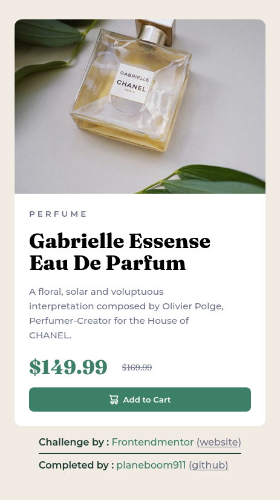
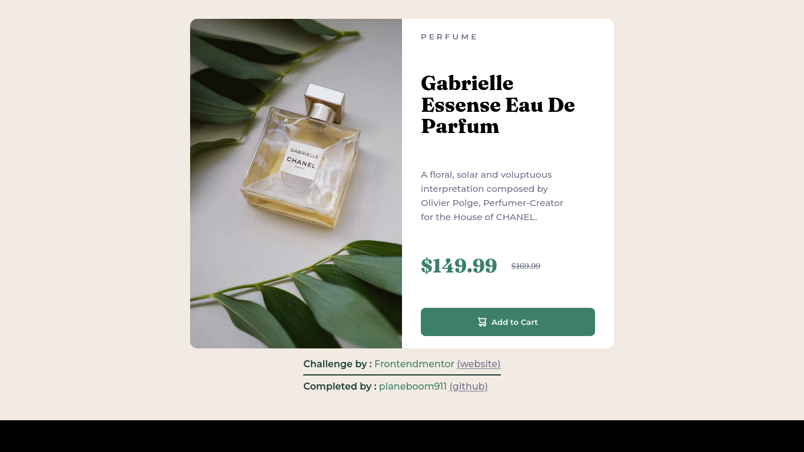

# Frontend Mentor - Product preview card component solution

This is a solution to the [Product preview card component challenge on Frontend Mentor](https://www.frontendmentor.io/challenges/product-preview-card-component-GO7UmttRfa). Frontend Mentor challenges help you improve your coding skills by building realistic projects. 

## Table of contents

- [Overview](#overview)
  - [The challenge](#the-challenge)
  - [Screenshot](#screenshot)
  - [Links](#links)
- [My process](#my-process)
  - [Built with](#built-with)
  - [What I learned](#what-i-learned)
  - [Continued development](#continued-development)
  - [Useful resources](#useful-resources)
- [Author](#author)
- [Acknowledgments](#acknowledgments)

## Overview

### The challenge

Users should be able to:

- View the optimal layout depending on their device's screen size
- See hover and focus states for interactive elements

The design should:

- closely match the original
- should be responsive

### Screenshot




### Links

- Solution : [Github](https://github.com/planeboom911/product_card_component)
- Live Site : [Live Site](https://planeboom911.github.io/product_card_component)

## My process

### Built with

- Semantic HTML5 markup
- CSS Grid
- Mobile-first workflow

### What I learned

I learned to build responsive layouts using grids. It was very interesting to start mobile first
and adjust the grid to desktop.

is it just me or everyone that uses this long css
for a button ?

```css
button {
  display: flex;
  align-items: center;
  justify-content: center;

  font-family: 'Montserrat', sans-serif;
  font-weight: 600;

  outline: none;
  border: none;
  cursor: pointer;

  width: 100%;
  max-height: 3rem;
  padding: 0.5rem;
  border-radius: 0.5rem;
  column-gap: 0.5rem;
  
  background: var(--cyan-dark);
  color: white;
}
/* Also button:focus-within, button:hover, & button:active states */
```

### Continued development

I will use grids more in future projects, I'm not that comfortable with grids yet. Like, there are so many
properties about grids that I don't know yet !

I mean the way of "telling" that the grid has 2 columns is :
`grid-template-column: repeat(2, minmax(0, 1fr))`

So... yeah, I got a lot to learn. haha !

### Useful resources

- [Google](https://www.google.com) - Google always helps guys
- [line-through solution](https://stackoverflow.com/a/72434985) - This here is a quite nice trick which helped me finally solve the problem of `line-through` not going through center.

## Author

- Github - [@planeboom911](https://github.com/planeboom911)
- Frontend Mentor - [@planeboom911](https://www.frontendmentor.io/profile/planeboom911)

## Acknowledgments

- Me (@planeboom911) : coding the site
- My brother : for reviewing the site :D
